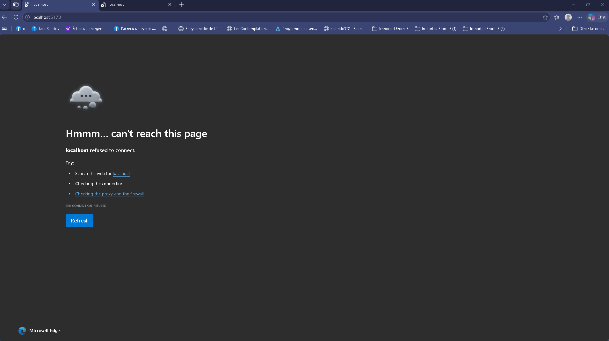

# WEB103 Project 1 - Smart Home Tech Explorer

Submitted by: Jean Pierre Joseph

About this web app: Smart Home Tech Explorer is an educational web application for exploring IoT devices and technologies used in smart home systems. The first version focuses on IoT devices such as the ESP32, Arduino Mega, Raspberry Pi, smart cameras, and smart plugs. Users can browse devices and open a detailed view to learn more about each technology.

Time spent: **5** hours

## Required Features

The following **required** functionality is completed:

<!-- Make sure to check off completed functionality below -->

- [x] **The web app uses only HTML, CSS, and JavaScript without a frontend framework**
- [x] **The web app displays a title**
- [x] **The web app displays at least five unique list items, each with at least three displayed attributes (such as title, text, and image)**
- [x] **The user can click on each item in the list to see a detailed view of it, including all database fields**
  - [x] **Each detail view should be a unique endpoint, such as as `localhost:3000/bosses/crystalguardian` and `localhost:3000/mantislords`**
  - [x] _Note: When showing this feature in the video walkthrough, please show the unique URL for each detailed view. We will not be able to give points if we cannot see the implementation_
- [x] **The web app serves an appropriate 404 page when no matching route is defined**
- [x] **The web app is styled using Picocss**

The following **optional** features are implemented:

- [x] The web app displays items in a unique format, such as cards rather than lists or animated list items

The following **additional** features are implemented:

- [x] List anything else that you added to improve the site's functionality!
  - [x] Responsive card layout for IoT devices, layout adapt to the screen size
  - [x] Added a custom favicon for Smart Home Tech Explorer

## Video Walkthrough

\*\*Note: please be sure to

Here's a walkthrough of implemented required features:

<!-- Replace this with whatever GIF tool you used! -->

GIF created with N-Studio

## Notes

One challenge was connecting the Vite frontend development server to the Express backend. I configured a Vite proxy so frontend requests to /devices are forwarded to the Express server during development.

## License

Copyright 2026 Jean Pierre Joseph

Licensed under the Apache License, Version 2.0 (the "License"); you may not use this file except in compliance with the License. You may obtain a copy of the License at

> http://www.apache.org/licenses/LICENSE-2.0

Unless required by applicable law or agreed to in writing, software distributed under the License is distributed on an "AS IS" BASIS, WITHOUT WARRANTIES OR CONDITIONS OF ANY KIND, either express or implied. See the License for the specific language governing permissions and limitations under the License.
